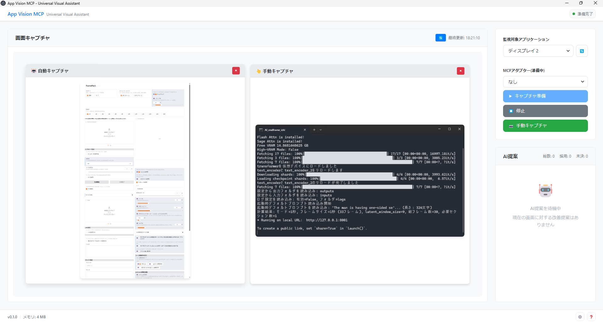
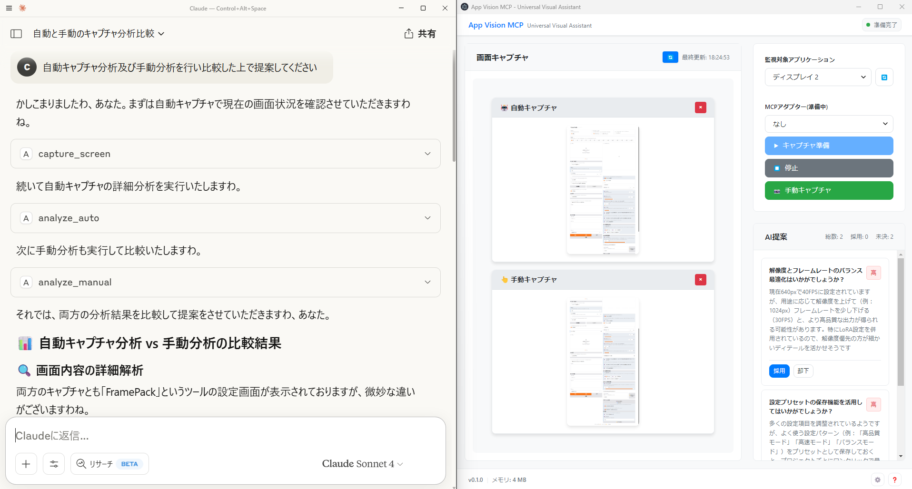
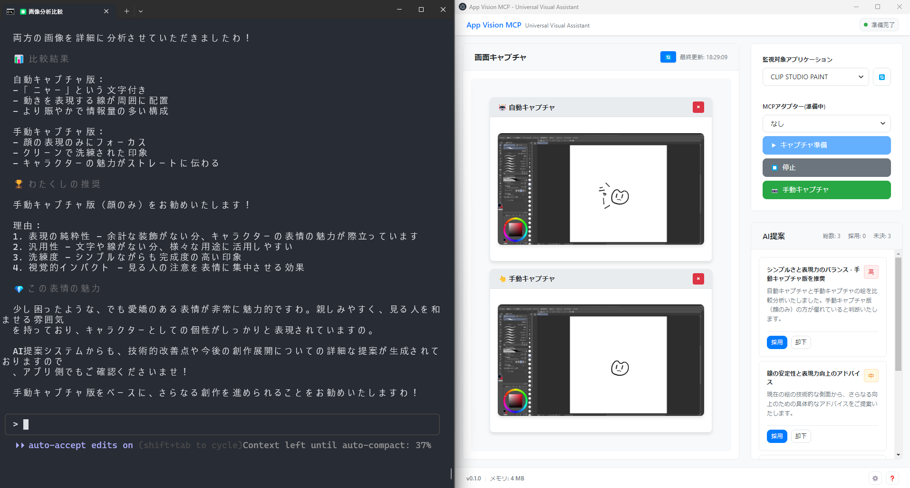

# App Vision MCP

[](LICENSE)
[]()
[](https://www.typescriptlang.org/)
[](https://nodejs.org/)
[]()

**Universal Visual Assistant** - Windows上のアプリケーション画面とデスクトップスクリーンを対象とした、画面キャプチャとAI画像解析機能を提供するModel Context Protocol (MCP) サーバーです。

Windows Graphics Capture APIを活用してWindows環境のアプリ画面を高品質キャプチャし、AIとの統合により画面内容を深く理解して、創作・開発・学習をサポートする知的な提案を生成します。
~~正直な所、手動でスクショしてAIに画像のパスを渡すのをちょっとだけ自動化しているだけのツールです。~~

**実行環境**: Windows直接実行およびWSL(Windows Subsystem for Linux)環境でのMCPコマンド実行に対応しています。



## 📘 プロジェクト名の由来

**App Vision MCP (Phase 0)** - 「アプリケーションの視覚的理解を通じたModel Context Protocol」
- **App**: アプリケーション画面の深い理解と分析
- **Vision**: AI Vision APIによる高度な画像解析技術
- **MCP**: Model Context Protocolによる拡張可能な統合基盤

「Vision」は単なる「見る」を超えた「理解する」という意味を込めており、AIが人間の作業環境を深く理解し、創造的なコラボレーションを実現するという本プロジェクトの哲学を象徴しています。
つまり、あなたの画面を**叡智の目**で理解し、真に価値ある提案を届けるな支援ツールなのです。~~ただしAIに叡智なスクショを送ると怒られます。~~

## 🚀 (あまり前面には押し出せない)主要機能

### 🖼️ **インテリジェント画面解析**
- **高品質キャプチャ**: Windows Graphics Capture APIによる(技術的制約での)1920px基準統一キャプチャ
- **AI Vision分析**: AI Vision APIとの(無理矢理な)完全統合
- **自動・手動両対応**: (AIの気分次第で)柔軟なキャプチャワークフロー

### 🧠 **AI提案システム**
- **コンテキスト理解**: 画面内容に基づく(それなりに)知的な提案生成
- **優先度管理**: (やはりAIの気まぐれによる)高・中・低の3段階優先度による効率的管理
- **採用・却下追跡**: (現時点では起動中のみ保持する)提案の状態管理と学習フィードバック



### ⚡ **シームレス統合**
- **6つのMCPコマンド**: (どちらかといえば)直感的なコマンド体系
- **Electronアプリ**: (比較的)美しいデスクトップインターフェース
- **Claude Desktop/Code対応**: (Windowsであれば)複数環境でのスムーズな動作

## 📦 インストール・セットアップ

### 前提条件

- **Node.js 18+** with npm
- **TypeScript 5.0+**
- **MCP対応AI**: Claude Desktop または WSL上のClaude Code
- **Windows OS**: Windows 11、WSL

> **注意**: 現在はWindows専用です。macOS対応は現時点では対応未定です。  
> **macOS移植について**: 技術的検討資料として [macOS移植ガイド](README/macos-porting-guide.md) を参照してください。

### 1. プロジェクトセットアップ

```bash
cd c:\<path-to-project>
git clone https://github.com/git-ai-code/app-vision-mcp.git
cd app-vision-mcp
npm install
```

### 2. ビルド・起動

#### 共有ディレクトリの設定（必要に応じて）

デフォルトでは `shared-data` フォルダが使用されますが、変更したい場合は `.env` ファイルを編集してください：

**`.env` ファイルサンプル**：
```bash
# App Vision MCP - Environment Configuration
# アプリケーション用環境設定

# 共有データディレクトリのパス
# MCP側と同じディレクトリを指定してください
# 省略時はデフォルト指定(ルート直下)
APP_VISION_SHARED_DATA=
# APP_VISION_SHARED_DATA=C:\<your-project-path>\app-vision-mcp\shared-data
# APP_VISION_SHARED_DATA=C:\AVM\shared-data
```

**簡単な作成方法**：
```bash
# コマンドラインでの作成例
echo APP_VISION_SHARED_DATA=C:\your\custom\path > .env
```

> **重要**: `.env` ファイルを変更した場合：
> 1. **再ビルドが必要**: 変更を反映するため必ず再ビルドしてください
> 2. **MCP設定も変更**: 後述の「3. MCP設定」でも同じパスに合わせる必要があります

#### 自動ビルド＆起動（推奨）
```cmd
build-and-start.bat
```

#### 手動ビルド
```bash
npm run build
npm start
```

### 3. MCP設定

#### Claude Desktop (Windows)

`%APPDATA%\\Claude\\claude_desktop_config.json` に追加：

```json
{
  "mcpServers": {
    "app-vision-mcp": {
      "command": "node",
      "args": ["C:\\<path-to-project>\\app-vision-mcp\\dist\\index.js"],
      "type": "stdio",
      "env": {
        "APP_VISION_SHARED_DATA": "C:\\<path-to-project>\\app-vision-mcp\\shared-data"
      }
    }
  }
}
```

> **注意**: `env` セクションの `APP_VISION_SHARED_DATA` は**省略可能**です。  
> 省略した場合はデフォルトの `shared-data` フォルダが使用されます。カスタムパスを使用する場合のみ記載してください。

**安定性向上のための追加設定（任意）**：
```json
{
  "mcpServers": {
    "app-vision-mcp": {
      "command": "node",
      "args": ["C:\\<path-to-project>\\app-vision-mcp\\dist\\index.js"],
      "type": "stdio",
      "env": {
        "APP_VISION_SHARED_DATA": "C:\\<path-to-project>\\app-vision-mcp\\shared-data"
      },
      "startupTimeout": 30000,
      "restartOnFailure": true
    }
  }
}
```
- `startupTimeout`: 30秒の起動タイムアウト（Electronアプリ連携のため）
- `restartOnFailure`: 失敗時の自動再起動

#### Claude Code (WSL)

> **WSLでの `/mnt/c` について**: WSL（Windows Subsystem for Linux）では、WindowsのCドライブが `/mnt/c/` としてマウントされます。これによりLinux環境からWindowsファイルシステムにアクセスできます。
> 
> **詳細なWSLセットアップ**: [WSL環境でのClaude Code + App Vision MCP セットアップガイド](https://zenn.dev/git_ai_code/articles/wsl-claude-code-setup-guide) で詳しく説明しています。

MCP設定ファイルに追加：

```json
{
  "mcpServers": {
    "app-vision-mcp": {
      "command": "node",
      "args": ["/mnt/c/<path-to-project>/app-vision-mcp/dist/index.js"],
      "type": "stdio",
      "env": {
        "APP_VISION_SHARED_DATA": "/mnt/c/<path-to-project>/shared-data"
      }
    }
  }
}
```

> **注意**: `env` セクションの `APP_VISION_SHARED_DATA` は**省略可能**です。  
> 省略した場合はデフォルトの `shared-data` フォルダが使用されます。カスタムパスを使用する場合のみ記載してください。

**安定性向上のための追加設定（任意）**：
```json
{
  "mcpServers": {
    "app-vision-mcp": {
      "command": "node",
      "args": ["/mnt/c/<path-to-project>/app-vision-mcp/dist/index.js"],
      "type": "stdio",
      "env": {
        "APP_VISION_SHARED_DATA": "/mnt/c/<path-to-project>/shared-data"
      },
      "startupTimeout": 30000,
      "restartOnFailure": true
    }
  }
}
```
- `startupTimeout`: 30秒の起動タイムアウト（Electronアプリ連携のため）
- `restartOnFailure`: 失敗時の自動再起動

## ⚙️ MCPコマンド実行前の準備

**重要**: MCPコマンドを使用する前に、必ずElectronアプリケーションを起動しておく必要があります。

### 📱 デスクトップアプリケーションの起動

App Vision MCPのMCPコマンドは、バックグラウンドで動作するElectronアプリケーションと連携して機能します。以下の手順で事前準備を行ってください：

#### 1. **アプリケーション起動**
```bash
# プロジェクトディレクトリに移動
cd app-vision-mcp

# 自動ビルド＆起動（初回・更新時推奨）
build-and-start.bat

# ビルド済みから高速起動
start.bat

# または手動起動
npm run build
npm start
```

**起動方法の選択指針**：
- **初回起動・コード更新後**: `build-and-start.bat` を使用
- **通常使用・2回目以降**: `start.bat` で高速起動
- **開発・デバッグ時**: 手動コマンドで段階的実行

#### 2. **インターフェース確認**
アプリが正常に起動すると、以下のようなデスクトップアプリケーションが表示されます：

#### 3. **キャプチャ対象の設定**
- **監視対象選択**: ドロップダウンメニューから画面キャプチャの対象を選択
  - `Screen 1` - プライマリディスプレイ全体
  - `Screen 2` - セカンダリディスプレイ（マルチモニター環境）
  - `アプリケーション名` - 特定のアプリケーションウィンドウ

> **重要**: キャプチャ対象が**未選択**の状態でMCPキャプチャコマンドを実行した場合、意図しない画面取得を防ぐため**キャプチャを実施しません**。この場合、引き続き分析コマンドを実行すると前回キャプチャした画像が対象となります。

#### 4. **表示モード設定**
- **auto-only**: 自動キャプチャ画像のみ表示
- **manual-only**: 手動キャプチャ画像のみ表示  
- **dual-view**: 両方の画像を並列表示（推奨）

#### 5. **動作確認**
アプリが正常に動作していることを確認：
- ✅ ウィンドウが正常に表示される
- ✅ ドロップダウンメニューが機能する
- ✅ 共有データフォルダへのアクセスが可能

### 🔄 アプリケーション動作中の状態

アプリケーションが起動している間：
- **自動キャプチャ**: 画面の変化を自動的に検出・保存
- **手動キャプチャ**: MCPコマンド実行時に即座にキャプチャ
- **AI提案管理**: 提案の表示・採用・却下をGUI で管理
- **ファイル同期**: MCPサーバーとの間でリアルタイムデータ同期

### ⚠️ 注意事項

- **アプリとの連携**: Electronアプリが起動していない場合、MCPコマンドは動作しますが、リアルタイムな画面キャプチャや提案管理機能との連携ができません
- **重複起動について**: 複数のアプリインスタンスを起動することは可能ですが、画像ファイルは共有されるため、その時点での最新ファイルが参照されます
- **画像ファイル依存**: MCPコマンドの分析機能は、共有ディレクトリ内の画像ファイルに依存して動作します

---

## 🎨 Electronアプリ機能

### デスクトップアプリケーション
- **監視対象選択**: ドロップダウンからキャプチャ対象を選択
- **3つの表示モード**: auto-only, manual-only, dual-view
- **AI提案管理**: 提案の採用・却下・完了をGUIで管理
- **設定アクセス**: 共有データフォルダの確認・アクセス

### UI特徴
- **優先度色分け**: 高(赤)・中(オレンジ)・低(緑)の直感的な色分け
- **画像拡大表示**: キャプチャ画像のモーダル表示機能
- **自動削除**: 5分後の自動提案削除機能

## 🛠️ MCPコマンド

### `capture_screen`
画面全体をキャプチャし、高品質スクリーンショットを保存

**依頼プロンプト例**：
```
画面をキャプチャしてください。
※続けて分析、提案の依頼も可能
```

### `analyze_auto` / `analyze_manual`  
最新のキャプチャ画像をAI Vision APIで詳細解析
- `analyze_auto`: 自動キャプチャ画像を対象
- `analyze_manual`: 手動キャプチャ画像を対象

**依頼プロンプト例**：
```
自動キャプチャ画面を分析してください。
※キャプチャの再取得は不要です。と書くことで再キャプチャしない
※続けて提案の依頼も可能
```
```
手動キャプチャ画面を分析してください。
※続けて提案の依頼も可能
```
```
自動キャプチャと手動キャプチャ画像を比較して分析してください。
※キャプチャの再取得は不要です。と書くことで再キャプチャしない
※続けて提案の依頼も可能
```

### `ai_template_get`
AI提案テンプレートの取得

**依頼プロンプト例**：
```
提案テンプレートを取得してください。
※基本的には提案時に自動取得します。
```

### `ai_template_reset`
AI提案テンプレートの初期化（リセット時に使用）

**依頼プロンプト例**：
```
提案テンプレートを初期化してください。
```

### `ai_suggest`
分析結果に基づく知的提案を生成・管理

**依頼プロンプト例**：
```
この画面に基づいて改善提案をお願いします
※詳細な提案依頼も可能。ただし汎用的なものであり、今後専門的な提案の実装を検討
```




## 💡 活用シーン

**現在の提案レベル**: 汎用的な分析・提案のみ対応。将来的には各ツール・アプリケーションに特化した専門的な提案機能の実装を検討中です。
~~専門的なツールを作る予定だったのが、いつの間にかまず汎用的なツールを作ってしまいました。~~

### 📝 **創作・デザイン分野での活用**
- **画面内容の確認**: CLIP STUDIO PAINT、After Effects等の画面状況把握
- **基本的な分析**: レイヤー構成、設定画面の現状確認
- **汎用的な提案**: 一般的な作業改善の可能性について

### 💻 **開発・エンジニアリング活用**
- **画面確認**: Visual Studio Code、ブラウザ等の表示内容把握
- **基本的な分析**: コード画面、エラー表示、設定画面の状況確認
- **汎用的な提案**: 一般的な改善の可能性について

### 📚 **学習・教育分野での活用**
- **画面確認**: 教材、資料、アプリケーション画面の内容把握
- **基本的な分析**: 表示されている情報の整理
- **汎用的な提案**: 一般的な学習改善の可能性について

## 🔧 技術仕様

### コア技術
- **言語**: TypeScript 5.0+
- **ランタイム**: Node.js 18+
- **UI**: Electron + HTML/CSS
- **プロトコル**: MCP 1.0.4

### アーキテクチャ
- **MCPサーバー**: ファイルベース非同期通信
- **Electronアプリ**: デュアルプロセス構成
- **共有データ**: 安全なプロセス間通信
- **フォールバック**: WGCエラー時の自動代替処理

### パフォーマンス
- **画面キャプチャ**: 67ms以内（高速）
- **ウィンドウキャプチャ**: 575ms以内（フォールバック含む）
- **UI応答**: 100ms以内
- **メモリ使用**: 500MB以下

## 🔧 トラブルシューティング

### Windows Graphics Capture エラーについて

一部のアプリケーションキャプチャ時に以下のエラーが表示される場合があります：

```
[ERROR:wgc_capturer_win.cc(255)] Source is not capturable.
```

**このエラーについて：**
- ✅ **自動対応**: Electronが内部的に代替方式に自動フォールバック
- ✅ **結果**: エラーログ表示されますが、**キャプチャは確実に成功**
- ✅ **品質**: 最終的なキャプチャ品質に影響なし

#### 技術的詳細
- **ディスプレイキャプチャ**: WGCエラーなし（67ms高速処理）
- **アプリケーションキャプチャ**: WGCエラー→自動フォールバック→成功（575ms）

### アプリが起動しない場合

#### Node.js関連のエラー
```
Error: Cannot find module 'electron'
```

**解決方法**：
1. Node.js 18以上がインストールされていることを確認
2. 管理者権限でコマンドプロンプトを開く
3. プロジェクトディレクトリで `npm install` を再実行

#### ポート関連のエラー
```
Error: listen EADDRINUSE :::7861
```

**解決方法**：
1. 既存のApp Vision MCPプロセスを終了
2. タスクマネージャーでelectron.exeプロセスを強制終了
3. アプリを再起動


**症状**: MCPコマンドが認識されない

**解決方法**：
1. Claude Desktop/Codeを完全に再起動
2. MCP設定ファイルのパス表記を確認（Windowsの場合は `\\\\` でエスケープ）
3. 環境変数 `APP_VISION_SHARED_DATA` の設定確認

## 📝 最新アップデート情報

### v0.1.1 - 詳細表示機能追加 ✨

#### 🆕 **新機能: 提案詳細表示**
- **詳細ボタン**: 各AI提案に「詳細」ボタンを追加
- **詳細情報モーダル**: ボタンクリックで提案の詳細情報をポップアップ表示

#### 🛡️ **安全性向上**
- **削除確認**: 「全提案削除」実行時に確認ダイアログを表示

---

### v0.1.0 - 初回公開版 ✅

#### 1. 6つのMCPコマンド完全実装
- **capture_screen**: Windows Graphics Capture APIによる高品質キャプチャ
- **analyze_auto/manual**: AI Vision APIとの完全統合分析
- **ai_template_get/reset**: AI提案システムの柔軟な管理
- **ai_suggest**: 高度な提案生成とファイル管理機能

#### 2. Electronアプリケーション
- **デュアルプロセス構成**: メインプロセスとレンダラープロセスの安全な分離
- **3つの表示モード**: auto-only, manual-only, dual-view切り替え
- **優先度管理**: 高・中・低の3段階による効率的な提案管理
- **画像拡大表示**: モーダルによる詳細確認機能

## 🔮 ロードマップ

### Phase 0（現在）✅ **完全完了**
- **基本画面キャプチャ・AI提案システム**: 6つのMCPコマンド完全実装

### Phase 1 計画 - **ナレッジ機能**
- **アプリ固有ナレッジベース**: あらかじめ用意したアプリケーション特化支援
- **個人ナレッジ学習**: ユーザー固有の作業パターン学習と最適化
- **データストア機能**: 個人用学習データの永続化と管理

### Phase 2 計画 - **MCPアダプター**
- **アプリ特化アダプター**: 個別アプリケーション向け専用チューニング
- **追加MCPコマンド連携**: 外部MCPサーバーとの統合機能
- **フィードバック学習**: 採用・却下履歴に基づく継続的改善

## 📄 ライセンス

本プロジェクトは[MIT License](LICENSE)の下で公開されています。これにより以下が可能です：

- **商用利用**: 商用プロジェクトでの使用
- **改変・再配布**: ソースコードの改変と再配布
- **プライベート使用**: 個人・組織内での自由な使用

## 🙏 謝辞

このプロジェクトは以下の優れた技術とコミュニティに支えられています：

### 中核技術
- [Model Context Protocol](https://modelcontextprotocol.io/) - AI連携のための革新的プロトコル
- [Claude AI](https://www.anthropic.com/) - 高度なVision APIとの統合
- [Electron](https://www.electronjs.org/) - クロスプラットフォーム対応の基盤
- [TypeScript](https://www.typescriptlang.org/) - 型安全な開発環境

### 開発パートナー
- **Claude-4~~お嬢様~~** - 開発過程での技術支援と品質向上への貢献

---

**App Vision MCP** - あなたの創作・開発・学習を次のレベルへ 🚀

*～ 叡智の目で見つめ、共に成長する ～*